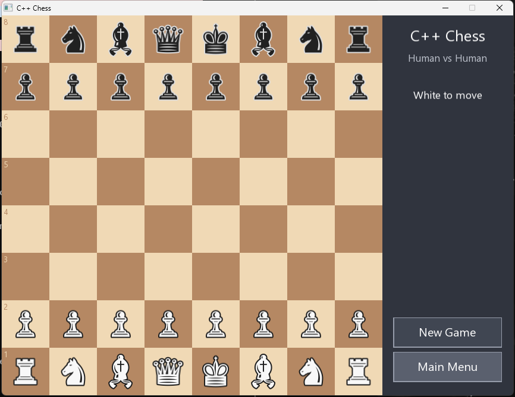

# C++ Chess

A graphical chess game in C++ with SFML 3. Human-vs-human and human-vs-AI,
full rules, mouse drag-and-drop.



## Features

- **Full legal rules**: castling, en passant, promotion (with a picker),
  check, checkmate, stalemate, the 50-move rule, threefold repetition, and
  insufficient-material draws.
- **Two modes**: Human vs Human, or Human vs AI (play as White or Black).
- **AI**: negamax search with alpha-beta pruning, a quiescence search, and a
  material + piece-square evaluation. Three difficulties (Easy / Medium / Hard)
  set the search depth; the AI runs on a background thread so the window stays
  responsive.
- **UI**: drag-and-drop, legal-move dots, last-move and check highlights, board
  flips when you play Black.

## Requirements

- MSYS2 mingw64 toolchain (g++ 16) with SFML 3 — already installed at
  `C:\msys64`.
- Windows fonts `seguisym.ttf` (chess glyphs) and `segoeui.ttf` (UI text),
  which ship with Windows.

## Build & run

```powershell
.\build.ps1        # compile -> chess.exe  (add -console to keep a console)
.\run.ps1          # run (puts the SFML DLLs on PATH for you)
```

Manual build:

```powershell
$env:PATH = "C:\msys64\mingw64\bin;$env:PATH"
g++ -std=c++20 -O2 main.cpp -o chess.exe -lsfml-graphics -lsfml-window -lsfml-system -mwindows
```

`chess.exe` needs `C:\msys64\mingw64\bin` on `PATH` at runtime (that's what
`run.ps1` does) so it can find the SFML DLLs.

## How to play

- Click a mode on the menu; pick a difficulty first if playing the AI.
- Drag a piece to a highlighted square to move. Promotions pop up a piece
  picker. **Esc** returns to the menu.
- Side-panel buttons: **New Game** restarts, **Main Menu** goes back.

## Project layout

| File | Purpose |
|------|---------|
| `chess.hpp`  | Engine: board, rules, move generation, evaluation, search (UI-independent). |
| `main.cpp`   | SFML front-end: window, menu, board rendering, input. |
| `perft.cpp`  | Move-generation verification (`perft.exe`). |
| `ai_test.cpp`| Evaluation/search sanity checks (`ai_test.exe`). |

## Tests

```powershell
$env:PATH = "C:\msys64\mingw64\bin;$env:PATH"
g++ -std=c++20 -O2 perft.cpp   -o perft.exe   ; .\perft.exe
g++ -std=c++20 -O2 ai_test.cpp -o ai_test.exe ; .\ai_test.exe
```

`perft.exe` counts legal move sequences for several standard positions and
compares them against published reference values (5.8M+ nodes, all matching) —
strong proof the move generator is correct. `ai_test.exe` checks that the
search finds a mate-in-one, wins a hanging queen, and that a self-play game
terminates.
